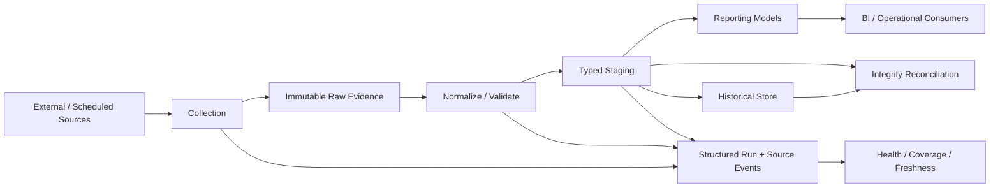

# Reliable Operations Platform

A clean-room engineering portfolio project that demonstrates how I turn a fragile, file-driven reporting workflow into an observable, restart-safe data operations platform.

> This repository is a from-scratch reconstruction of **general engineering patterns**. It contains no employer source code, production data, internal names, customer or supplier identifiers, screenshots, credentials, proprietary business rules, or copied internal documentation.

## What this demonstrates

The project focuses on the reliability problems that appear when scheduled data work grows beyond a collection of scripts:

- modular Python orchestration with explicit failure boundaries
- durable run and step state
- safe resume after interruption
- idempotent input registration
- recoverable warnings versus fatal failures
- required-source freshness policies
- expected-source coverage classification
- structured operational events instead of log-only diagnosis
- raw-to-staging integrity reconciliation
- isolated, synthetic replay tests
- separation of durable historical truth from reporting-serving models

The demonstration uses Python and SQLite so it is easy to run locally. The architecture is intentionally compatible with replacing the local store with PostgreSQL or another durable relational database.

## Architecture



## Why reliability is modeled explicitly

A process can finish without producing trustworthy data. A source can be late without throwing an exception. A partially completed run can leave valid work that should not be repeated. A dashboard can refresh while still serving stale inputs.

So the platform treats these as separate questions:

1. Did the process run?
2. Which steps actually completed?
3. Which expected sources produced usable data?
4. Is the accepted data fresh enough?
5. Are raw and typed layers still reconciled?
6. Can an interrupted run continue without duplicating work?

## Run it

Requires Python 3.11+.

```bash
python -m pip install -e .
python -m reliable_ops.demo --workspace .demo
pytest
```

Example demo output summarizes the pipeline result, source coverage, and an integrity check. Everything is generated locally from synthetic inputs.

## Repository guide

- [`docs/case-study.md`](docs/case-study.md) — engineering story and decisions
- [`docs/architecture.md`](docs/architecture.md) — component boundaries and data flow
- [`docs/reliability-patterns.md`](docs/reliability-patterns.md) — production reliability patterns
- [`docs/testing-and-replay.md`](docs/testing-and-replay.md) — safe replay and qualification strategy
- [`docs/clean-room-boundary.md`](docs/clean-room-boundary.md) — sanitization policy
- [`docs/interview-notes.md`](docs/interview-notes.md) — concise discussion prompts
- [`src/reliable_ops/`](src/reliable_ops/) — runnable clean-room implementation
- [`tests/`](tests/) — regression tests for restart, idempotency, freshness, coverage, and integrity

## Design principle

The core idea is simple:

> **Operational state should be modeled as data, not reconstructed from operator memory and raw logs.**

That principle drives the run ledger, source outcomes, coverage states, freshness checks, and integrity controls demonstrated here.
